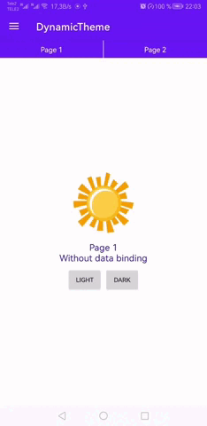

# DynamicTheme
Dynamic change of the android app theme, as telegram

# Preview


# How to use
1\. Create an abstract class 'MyAppTheme' that extends 'DynamicTheme'.
```
abstract class MyAppTheme : DynamicTheme() {

    abstract fun imageDrawable(): Drawable?

    abstract fun backgroundColor(): Int
}
```

2\. Create 2 classes for a light and dark theme implementing 'MyAppTheme'
```
class LightTheme : MyAppTheme() {
    override val type = DynamicThemeType.LIGHT

    override fun imageDrawable(): Drawable? = getDrawable(R.drawable.image_sun)

    override fun backgroundColor() = getColor(R.color.white)
}
```
```
class DarkTheme : MyAppTheme() {
    override val type = DynamicThemeType.DARK

    override fun imageDrawable(): Drawable? = getDrawable(R.drawable.image_moon)

    override fun backgroundColor() = getColor(R.color.black)
}
```

3\. Initialize the created themes in your application class
```
class App : Application() {
    override fun onCreate() {
        super.onCreate()
        DynamicThemeManager.init(
            Pair(LightTheme(), DarkTheme())
        ) {
            baseContext
        }
    }
}
```

4\. Use DynamicThemeActivity, DynamicThemeFragment, DynamicThemeDialog
```
class MainActivity : DynamicThemeActivity<MyAppTheme>() {
  override fun syncTheme(appTheme: MyAppTheme) {
          binding.apply {
              layout.setBackgroundColor(appTheme.backgroundColor())
              image.setImageDrawable(appTheme.imageDrawable())
          }
      }
}
```
```
class MyFragment : DynamicThemeFragment<MyAppTheme>() {
  override fun syncTheme(appTheme: MyAppTheme) {
          binding.apply {
              layout.setBackgroundColor(appTheme.backgroundColor())
              image.setImageDrawable(appTheme.imageDrawable())
          }
      }
}
```
```
class MyDialog : DynamicThemeDialog<DynamicTheme>() {
  override fun syncTheme(appTheme: MyAppTheme) {
            binding.apply {
                layout.setBackgroundColor(appTheme.backgroundColor())
                image.setImageDrawable(appTheme.imageDrawable())
            }
        }
}
```

5\. Use data binding
```
<layout xmlns:android="http://schemas.android.com/apk/res/android">
    <data>
        <import type="com.alab.dynamic_theme.DynamicThemeManager" />
        <import type="com.alab.dynamic_theme.DynamicThemeType" />
    </data>

    <FrameLayout
        android:layout_width="match_parent"
        android:layout_height="match_parent"
        android:background="@{DynamicThemeManager.manager.themeTypeLiveData == DynamicThemeType.LIGHT ? @color/white : @color/black}">

            <ImageView
                android:layout_width="wrap_content"
                android:layout_height="wrap_content"
                android:src="@{DynamicThemeManager.manager.themeTypeLiveData == DynamicThemeType.LIGHT ? @drawable/sun : @drawable/moon}"/>
        
    </FrameLayout>
</layout>
```


# To get a Git project into your build:
Add it in your root build.gradle at the end of repositories
```
allprojects {
	repositories {
		...
		maven { url 'https://jitpack.io' }
	}
}
```
```
Add the dependency
dependencies {
	implementation 'com.github.AndroidLab:DynamicTheme:Tag'
}
```
